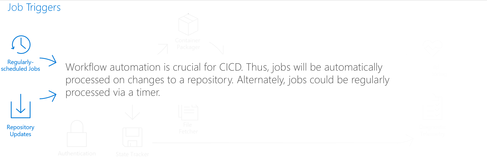
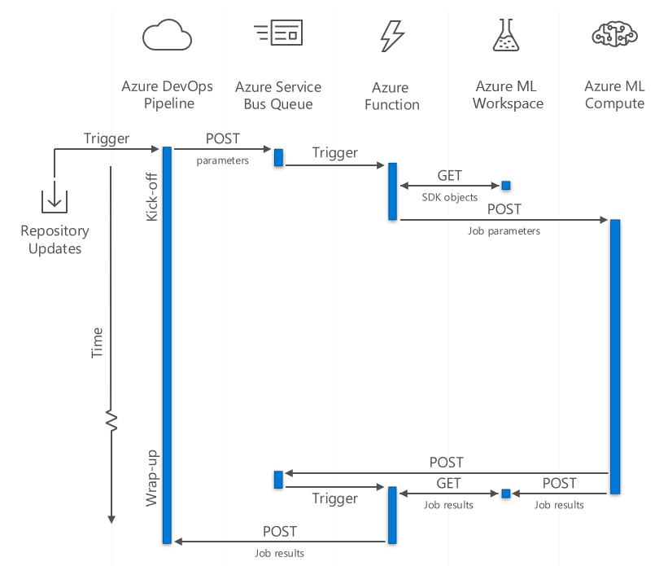
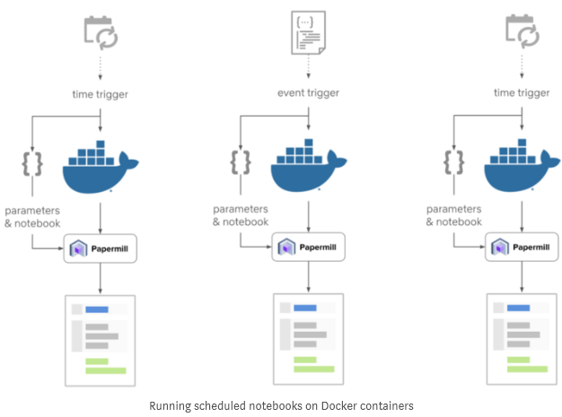

# Azure ML Operationalization

[](https://dev.azure.com/t-brhung/brhung-test-pipeline/_build/latest?definitionId=8&branchName=master)

Streamlining and Expediating a data scientist's CI/CD workflow leveraging prebaked functionalities of Azure DevOps Pipelines, Azure Functions, and Azure Service Bus Queues.

### Key aspects:
- [Azure DevOps Pipelines](https://azure.microsoft.com/en-us/services/devops/pipelines/)
- [Azure Service Bus](https://azure.microsoft.com/en-us/services/service-bus/)
- [Azure Functions](https://azure.microsoft.com/en-us/services/functions/)
- [Azure Machine Learning](https://azure.microsoft.com/en-us/services/machine-learning-service/)

Azure Python Functions can cleanly interact with the Azure ML SDK and can be easily integrated into Azure DevOps Pipelines. To quickly get up and running with your own implementation, documentation can be found [here][functions-create-first-function-python].

### Core dependencies 
- [Python 3.6.8][download-python]
- [Azure Functions Core Tools][functions-run-local]
- [Azure CLI][install-azure-cli]
- [Azure ML SDK + Contrib][install-azure-ml-sdk]

# Visualizing the Pipeline




# The File Directory

> - FunctionApp
> > - ServiceBusQueueTrigger
> > > - ```__init__.py```
> > > - ```function.json```
> > - ```azure-pipelines.yml```
> > - ```requirements.txt``` 

## ```azure-pipelines.yml```

This file controls the DevOps pipeline flow. The pipeline required for this project is very simple. The first snippet seen below defines the [server job](https://docs.microsoft.com/en-us/azure/devops/pipelines/process/phases?tabs=yaml&view=azure-devops#server-jobs):

```yml
jobs:
- job: test 
  timeoutInMinutes: 10 # Defining Max Runtime
  pool: server # Defining Server Job
```
Then, the only step in the pipeline is to publish the Azure ML Compute run parameters to a Service Bus Queue that will trigger the Azure Function to package and send the request:

```yml
  # Kick Off:
  steps:
  - task: PublishToAzureServiceBus@1
    inputs:
      azureSubscription: 'test' # Defined in DevOps Project Settings -> Service Connections
      messageBody: '{"job":"kick_off", ...}' # See azure-pipeline-paramters.json
      waitForCompletion: true # Allows for POST callback to close pipeline
```

## ```requirements.txt```

This file controls the dependencies required for the Azure Function. This is mainly the Azure ML SDK, its associated dependencies, and support for HTTP requests, file system manipulation, etc.

```
...
azureml==0.2.7
azureml-contrib-notebook==1.0.43.*
azureml-core==1.0.43
azureml-pipeline==1.0.43
azureml-sdk==1.0.43
...
```

When deploying the function app, these are injected into the package, as seem in the deployment YAML file:

```
pip3.6 install -r requirements.txt
```

## ```function.json```

This file controls where the app looks for a main function (in this case, ```__init__.py```), as well as the bindings for the app. We can see below what the binding for a Service Bus Queue looks like:

```json
{
  "scriptFile": "__init__.py",
  "bindings": [
    {
      "name": "msg",
      "type": "serviceBusTrigger",
      "direction": "in",
      "queueName": "function-queue",
      "connection": "test"
    }
  ]
}
```

## ```__init__.py```

This script holds all the pythonic logic of the application. The main function is short, favoring helper functions to handle the two distinct cases: ```kick_off()``` and ```wrap_up()```. 


### ```kick_off()```

Kick-off fetches the repository of interest, and submits a new notebook run for each notebook specified in the input parameters. Before submitting the notebook(s), it injects try-catch statements into them to enable call-backs to the Azure Function in case of failures. 
 

### ```wrap_up()```

Wrap-up updates the test runs in DevOps, and checks if the experiment has finished executing all runs in the Azure ML Workspace. If it has, it closes the pipeline.


# Tests Conducted

** TBD: Azure ML notebooks that require additional permissions... **

Successfully Runs:

CPU:

- SAR 
- FASTAI
- LIGHTGBM
- SURPRISE
- NCF

GPU:
- xDeepFM

Failed runs were due to:

- Fully commented blocks of code
  - Solution: manually removed block of all commented lines
- Empty blocks of code
  - Solution: manually removed empty block
- Unaccounted-for dependencies (e.g. Tensorflow's pip dependency)
  - Solution: add tensorflow's pip dependency to the Conda file
- "Java gateway process exited before sending its port number" ("notebooks/00_quick_start/als_movielens.ipynb", )
  - Java Dependency issue....
- import __future__ statements ("notebooks/00_quick_start/rbm_movielens.ipynb")
  - Solution: ...
  - In theory, could scan for import __future__ and place them at the very top


# Glossary

## DevOps Pipeline Variables

| Name            	| Description                                          	| Example Value                                    	| Where To Find                              	|
|-----------------	|------------------------------------------------------	|--------------------------------------------------	|--------------------------------------------	|
| sb.connection   	| Service Bus Queue's Connection String                	| Endpoint=sb://example.servicebus.windows.net/... 	| Service Bus Queue's Shared Access Policies 	|
| sb.name         	| Service Bus Queue's Name                             	| example-queue-name                               	| Service Bus Queue's Mnemonic Name          	|
| sp.password     	| Service Principal's Password                         	| 32 character alphanumeric string (e.g. A/fb0...) 	| App Registration's Client Secret           	|
| sp.client       	| Service Principal's Application (client) ID          	| GUID (e.g. a1234567-89bc-0123-def4-abc56789def)  	| App Registration's Overview                	|
| sp.tenant       	| Service Principal's Directory (tenant) ID            	| GUID (e.g. a1234567-89bc-0123-def4-abc56789def)  	| App Registration's Overview                	|
| ws.subscription 	| Machine Learning Service Workspace's Subscription ID 	| GUID (e.g. a1234567-89bc-0123-def4-abc56789def)  	| Workspace's Overview                       	|

# Notes 

service bus connection string
azure service bus
https://dev.azure.com/t-brhung/brhung-test-pipeline/_settings/adminservices
for function.json

enable function ==> function -> "configuration" (application settings) -> new application setting

# Relevant Documentation

- [Creating your first python function][functions-create-first-function-python]
- [Installing the Azure CLI][install-azure-cli]
- [Installing the Azure ML SDK][install-azure-ml-sdk]

# References

- [Github: Correction to Python Azure Function Documentation](https://github.com/MicrosoftDocs/azure-docs/pull/31932)
  - Shows how much of the Python Azure Function documentation is sparse and relatively untested. 
  - 

- [Medium: Notebooks at Netflix](https://medium.com/netflix-techblog/scheduling-notebooks-348e6c14cfd6)
  - Shows the relevancy of notebook-based machine learning operationalization for large corporations.
  - Highlights relevant sticking points from an data scientist's perspective.
  - 
  
- [Github: Data Scientists are Asking for CI/CD Solutions](https://github.com/Azure/azure-functions-core-tools/issues/640)
  - Evidence data scientists are seeking solutions to workflow optimization, and Azure is only beginning to offer these services.
  - 


## To-do

- [x] Defining Requirements  
  - [x] Creating a list of requirements to address and streamline a data scientists' CICD workflow.
    - *Priority:* 0
    - *Definition of Done:* managerial approval and submission of first Connect.
  - [x] Submitting a design proposal for the project. 
    - *Priority:* 0
    - *Definition of Done:* MLOps team approval, followed by integration of team's feedback.
  - [x] Implementing triggers to assist in operationalization of Azure ML.
    - *Priority:* 0
    - *Definition of Done:* if a job can be created via the Azure ML SDK or underlying REST API calls.
  - [x] Integrating Agentless Service into an Azure DevOps Pipeline, which has prebaked support for triggers, call-backs, state management.
    - *Priority:* 1
    - *Definition of Done:* if a job can be triggered from a typical use case (e.g. a pull request on a GitHub repository) to assist in streamlining CICD workflows.
  - [x] Demonstrating use-cases of implemented functionalities.
    - *Priority:* 1
    - *Definition of Done:* a real-time demonstration of project to MLOps team, followed by integration of team's feedback.      
  - [ ] Populating telemetry results, results from trainings, output notebooks, etc. from Azure ML into Azure DevOps.
    - *Priority:* 2
    - *Definition of Done:* job-specific results can be parsed and inputted back into the Azure DevOps dashboard for viewing.
  - *Estimated Time:* 1 week
- [x] Design Documentation
  - Estimated Time: 1 week
  - [x] Manager Approval
- [x] Proof of Concept
  - Estimated Time: 4-6 weeks
- [ ] Implemetation of Azure Function Application
  - Estimated Time: 3-5 weeks
- [ ] Presentation
  - Estimated Time: 1 week


[functions-create-first-function-python]: https://docs.microsoft.com/en-us/azure/azure-functions/functions-create-first-function-python
[install-azure-cli]: https://docs.microsoft.com/en-us/cli/azure/install-azure-cli
[functions-run-local]: https://docs.microsoft.com/en-us/azure/azure-functions/functions-run-local#v2
[download-python]: https://www.python.org/downloads/
[install-azure-ml-sdk]: https://docs.microsoft.com/en-us/python/api/overview/azure/ml/install?view=azure-ml-py
[functions-triggers-bindings]: https://docs.microsoft.com/en-us/azure/azure-functions/functions-triggers-bindings